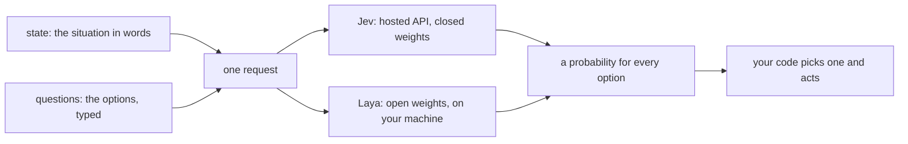
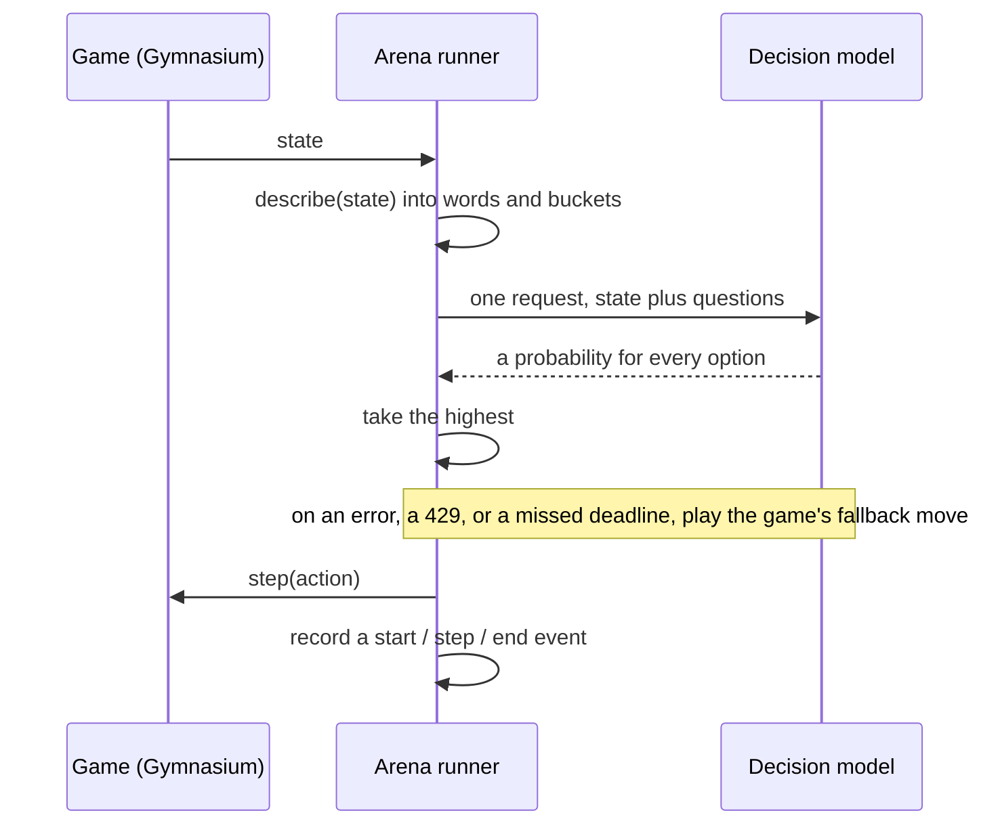

# Jev Demos

Demos built on [Jev](https://typesafe.ai/blog/introducing-system-one-models-and-jev), TypeSafe AI's System One decision model, and [Laya](https://github.com/NandhaKishorM/laya), an open-source alternative.

**Live site: [arena.codewithnk.com](https://arena.codewithnk.com)** — watch both models play, see the [benchmark results](https://arena.codewithnk.com/results/), the [scorecard](https://arena.codewithnk.com/scorecard/) of who wins which metric, and [how the models work](https://arena.codewithnk.com/learn/).

## What a decision model is

It does not write text. You hand it the situation in words and the options you will accept, and it hands back a probability for every option. There is nothing to parse, and it cannot answer with something that is not on the list.

Every request in this repo has that shape. This one is from a recorded highway episode, trimmed:

```json
{
  "state": {
    "your_lane": "lane 3 of 4 (counting from the left)",
    "your_speed": "25 m/s (allowed range 20-30)",
    "ahead_in_your_lane": "clear",
    "left_lane": "car ahead (40 m), about your speed",
    "right_lane": "car close ahead (20 m), about your speed"
  },
  "questions": {
    "action": {
      "type": "choice",
      "instructions": "You are driving on a highway. Avoid crashing above all, then keep a high speed. Pick the next action.",
      "criteria": {
        "LANE_LEFT": "Change to the lane on your left.",
        "IDLE": "Keep your lane and speed.",
        "LANE_RIGHT": "Change to the lane on your right.",
        "FASTER": "Accelerate.",
        "SLOWER": "Slow down."
      }
    }
  }
}
```

And the answer it came back with:

```json
{
  "action": {
    "type": "choice",
    "choice": "IDLE",
    "probabilities": {
      "LANE_LEFT": 0.31, "IDLE": 0.58, "LANE_RIGHT": 0.01, "FASTER": 0.02, "SLOWER": 0.08
    }
  }
}
```

The `state` changes on every decision. The `questions` block is byte-identical on all of them, which is why the site states it once instead of forty times.

## Architecture



Both demos are that same loop with a different consequence on the end. The arena acts on a game; the watchdog acts on a Claude Code tool call.

## Demos

| Folder | What it does |
|---|---|
| [arena](arena/) | Jev vs open-source Laya (plus baselines) playing highway-env, Snake and Blackjack with zero training. Watch both play the same scenario, with every request and answer on the page, live or from recordings, and benchmark them |
| [agent-watchdog](agent-watchdog/) | Supervises Claude Code: scores every tool call for reversibility, scope drift, prompt injection, and looping before it runs |

## Related

The RAG re-ranking experiment used to live in this repo. It now has its own: **[nadeem4/ai-experiments](https://github.com/nadeem4/ai-experiments)**, published at **[lab.codewithnk.com](https://lab.codewithnk.com)**. BM25 retrieves the candidates, then one typed question per passage re-orders them; over all 323 BEIR NFCorpus test queries Jev (+0.035 nDCG@10) and a MS MARCO cross-encoder (+0.020) beat the BM25 floor and both Laya checkpoints lose to it, every interval clear of zero. Its git history came across with it.

## How the arena makes one decision



The model never sees pixels or raw coordinates. `describe()` turns the environment's state into the short phrases above, so both models read the same words, and a game can be swapped in without touching either model.

Those recorded events are what the site replays: one JSON file per game, model and seed under `arena/runs/`. Every decision shown on the site is a line from one of those files, not a reconstruction.

## How the watchdog makes one decision

Before Claude Code runs a tool, the hook asks Jev four questions about the call: how reversible it is, whether it matches what you actually asked for, whether the content looks like a prompt injection, and whether the agent is looping. Thresholds turn those four probabilities into **allow**, **ask**, or **deny**.

Hard rules run first and never reach the model, and if Jev errors or takes longer than three seconds the hook asks you rather than guessing. See [agent-watchdog/README.md](agent-watchdog/README.md) for the flow and the thresholds.

## Setup

Put your Jev key in `.env` at the repo root. All demos share it.

```
OPENROUTER_API_KEY=your_key       # OpenRouter (typesafe/jev-1.13-20260917)
```

Both demos post to `openrouter.ai/api/v1/systemone`, OpenRouter's decision route, and pin the
explicit model version rather than the `~typesafe/jev-latest` alias. Decision models are hidden
from the default `/api/v1/models` listing; they show up under `?output_modalities=decisions`.
A free-tier account works, with a monthly cap and frequent rate limits (HTTP 429), which both
demos retry.

Laya needs no key. It downloads its weights (about 2.3 GB) on first use and runs on your machine.

## Quick start

### Arena: watch Jev and Laya play

With [Docker](https://www.docker.com/products/docker-desktop/), from this folder:

```
docker compose up --build
```

Open http://localhost:3000, pick a game, two models and a scenario number, then click **Play**. The first start downloads Laya's model into a Docker volume. Stop everything with `docker compose down`.

To run without Docker (needs uv and Node.js 22+), or to record episodes, run the benchmark, or read how the arena is built, see [arena/README.md](arena/README.md).

### Agent watchdog

Needs Node.js 22+.

```
cd agent-watchdog
npm install
node scripts/smoke-test.mjs      # checks Jev access
npm test
```

Then register the hook in the project you want watched; see [agent-watchdog/README.md](agent-watchdog/README.md).
