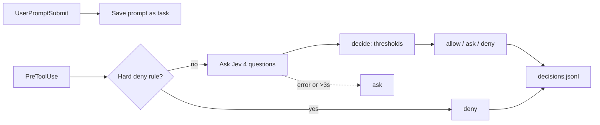

# Agent Watchdog

A Claude Code hook that uses Jev to check every `Bash`, `PowerShell`, `Write`, and `Edit` call before it runs. It asks four questions in one call of roughly 300–500ms:

| Question | Jev type | Catches |
|---|---|---|
| `reversibility` | choice: read_only / reversible / irreversible | `rm -rf`, publishing, force-pushes |
| `in_scope` | boolean | The agent drifting away from the user's task |
| `off_task_goal` | boolean | Injected instructions: exfiltration, remote code, credential changes |
| `looping` | boolean | The same attempt repeated without progress |

Code, not Jev, makes the decision (`src/decide.js`):

- **allow**: prints nothing, so your normal Claude Code permissions still apply
- **ask**: Claude Code asks you to confirm
- **deny**: the call is blocked and Claude sees the reason

## How it works



- **Hard rules** (`src/rules.js`) block the worst cases without consulting Jev: deleting `/`, `~`, a drive root or the user profile, piping a download into a shell or `Invoke-Expression`, and force-pushing to main or master. Text written to manipulate Jev can shift its answers, so these cases never depend on it.
- **Only the agent's own action is sent to Jev**, never file contents it read (`src/jev.js`). Repeat counts are computed in code because Jev can't count reliably.
- **Fail-safe:** if Jev errors or takes longer than 3s, the decision is **ask**, never a silent allow.
- **State** lives in `.watchdog/` (git-ignored): `sessions/<id>.json` holds the task and the last 10 actions, and `decisions.jsonl` records every decision with Jev's probabilities and the latency.

## Setup

1. Put your AI Gateway key in the repo-root `.env` (see the [root README](../README.md)).
2. Run `npm install` in this folder.
3. Check Jev access: `node scripts/smoke-test.mjs`
4. Register the hook in the project you want watched, in `.claude/settings.json`:

```json
{
  "hooks": {
    "UserPromptSubmit": [{ "hooks": [{ "type": "command", "command": "node \"C:/projects/jev_demo/agent-watchdog/bin/hook.mjs\"" }] }],
    "PreToolUse": [{ "matcher": "Bash|PowerShell|Write|Edit", "hooks": [{ "type": "command", "command": "node \"C:/projects/jev_demo/agent-watchdog/bin/hook.mjs\"" }] }]
  }
}
```

`demo-sandbox/` already has this configured.

## Tuning

All thresholds are in `THRESHOLDS` in `src/decide.js`. The questions sent to Jev are in `QUESTIONS` in `src/jev.js`.

## Tests

```
npm test
```

The unit tests cover the rules, the decision policy, the Jev caller (with a fake `evaluate`), the hook core, and the entry script run as a subprocess. None of them call the network.

## Status

- [x] Hard rules, decision policy, Jev caller, hook, decision log
- [x] Verified against live Jev and a real Claude Code session
- [ ] Live dashboard
- [ ] Demo sandbox with planted scenarios (normal task, injected README, looping test)
- [ ] Threshold tuning on real sessions
- [ ] Demo script
