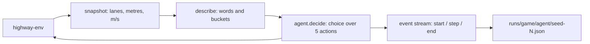

# Arena

A benchmark where decision models (TypeSafe's **Jev** and open-source **Laya**) play standard RL environments with zero training. The first game is [highway-env](https://github.com/Farama-Foundation/HighwayEnv) (`highway-v0`).

## How it works



- **`arena/highway/describe.py`** turns the road into words ("car close ahead (12 m), 4 m/s slower than you", "BLOCKED: car right beside you"). Decision models read meaning and can't do arithmetic, so raw coordinates are never sent.
- **`arena/agents/`** holds one file per model. Every agent has the same interface, `decide(state, questions) -> answers`:
  - `jev.py`: everything Jev-specific. It calls TypeSafe directly or through Vercel AI Gateway over HTTP, picks the key with `from_env()`, retries 429 and 529 responses with backoff, and reports only the successful attempt's latency.
  - `laya.py`: everything Laya-specific. It downloads the weights on first use (`ensure_weights`), chooses the checkpoint, and runs the model locally.
  - `baselines.py`: the keep-lane and random drivers.
  - `__init__.py`: `make_agent(name)` is the only place an agent is chosen by name.
- **`arena/highway/runner.py`** yields a `start` event, one `step` event per decision (frame, state, answers, action, latency), then an `end` event. The same stream serves as a recording and, later, as a live feed. A failed decision falls back to `IDLE` and is recorded with an `error` field.
- **`arena/record.py`** saves episodes to `runs/<game>/<agent>/seed-<n>.json` and prints a summary: crash rate, distance, reward, speed, and median latency.

## Run it with Docker (one command)

From the repo root:

```
docker compose up --build
```

Open http://localhost:3000. `compose.yaml` starts two containers:

- `arena-api` (port 8000) is this Python package. It runs PyTorch on CPU, since GPU containers need a newer NVIDIA driver, and the image is about 2 GB. Laya's weights download into the `laya-models` volume on first start, so they survive rebuilds. `runs/` is shared with your machine.
- `arena-ui` (port 3000) is `ui/`, built to static files and served by nginx. The image is about 94 MB.

API keys come from the repo-root `.env`. Stop everything with `docker compose down`. The API uses about 1.7 GB of memory once Laya is loaded.

## Setup (without Docker)

```
uv sync
```

`uv sync` installs the `laya` package, which is code only. Laya's weights (2.3 GB) download into `models/laya` the first time Laya runs.

Jev looks for keys in the environment, then in the repo-root `.env`:

- `TYPESAFE_API_KEY` is preferred. It calls `api.typesafe.ai/v1/systemone` directly with the pinned model `jev-1.13.0`, so runs are reproducible and there's no extra network hop. TypeSafe signups are currently paused.
- `AI_GATEWAY_API_KEY` is the fallback, through Vercel AI Gateway (`typesafe-ai/jev`). The Gateway rate-limits often (HTTP 429), and the agent retries those with backoff.

Weights go into a plain folder, not the Hugging Face cache, because the cache uses symlinks that fail on Windows without Developer Mode. Locally, PyTorch comes from the CUDA 12.6 index (`pyproject.toml`). Set `LAYA_PATH` to keep the weights somewhere other than `models/laya`. If your NVIDIA driver is too old, Laya falls back to CPU at roughly 200–2000ms per decision, compared with about 33ms on a GPU.

## Watch them drive

With Docker, `docker compose up` is all you need. Without Docker, run the API and the UI in two terminals:

```
uv run python -m arena.server              # API on http://localhost:8000
cd ui && npm install && npm run dev        # UI on http://localhost:3000
```

Open http://localhost:3000, pick a model for each side and a traffic number, then click **Play**. Both roads get identical traffic.

- **Live** runs both models right now. The server starts loading Laya when it launches, and both roads wait for each other so they start together.
- **Recording** replays episodes from `runs/`, which is instant and needs no API calls.

The two roads sit in the middle, and each model's panel sits on its outer side:

- **What it sees** is the exact text the model read at this step. Blocked lanes and very close cars are shown in red.
- **What it decides** shows the model's probability for each of the five moves, with the chosen move highlighted.
- **Warnings** appear under the decision when the move is impossible (a lane change into a lane that doesn't exist), goes into a blocked lane, or was made with under 50% confidence.

The server (`arena/server.py`) uses only the Python standard library. Live play uses server-sent events and recordings are JSON files. The browser connects to it directly (it sends `Access-Control-Allow-Origin: *`) because a dev proxy breaks long event streams. Point the UI elsewhere with `NEXT_PUBLIC_ARENA_API`.

## Record episodes

```
uv run python -m arena.record --agent jev --episodes 3
uv run python -m arena.record --agent laya --laya-checkpoint multilingual --episodes 3
uv run python -m arena.record --agent idle --episodes 3      # or: random
uv run pytest
```

Episodes with the same seed have identical traffic, so every agent faces the same situations.

## First results (3 episodes, seeds 0–2, Laya on CPU)

| Agent | Crashes | Avg distance | Avg speed | p50 latency |
|---|---|---|---|---|
| Jev | 0/3 | 823 m | 20.5 m/s | 322 ms |
| Laya (multilingual) | 2/3 | 474 m | 23.6 m/s | 272 ms |
| Random | 3/3 | 519 m | 25.7 m/s | — |
| Always IDLE | 3/3 | 504 m | 24.5 m/s | — |

Three episodes are too few to draw conclusions. The full benchmark runs in Colab on a GPU.
