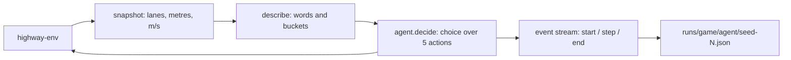

# Arena

A benchmark where decision models (TypeSafe's **Jev** and open-source **Laya**) play standard RL environments with zero training. The first game is [highway-env](https://github.com/Farama-Foundation/HighwayEnv) (`highway-v0`).

## How it works



- **`arena/highway/describe.py`** turns the road into words ("car close ahead (12 m), 4 m/s slower than you", "BLOCKED: car right beside you"). Decision models read meaning and can't do arithmetic, so raw coordinates are never sent.
- **`arena/agents.py`** gives every agent the same interface, `decide(state, questions) -> answers`:
  - `JevAgent` calls TypeSafe directly or through Vercel AI Gateway, over HTTP. It retries 429 and 529 responses with backoff, and reports only the successful attempt's latency.
  - `LayaAgent` runs the model locally.
  - `ConstantAgent` and `RandomAgent` are baselines.
- **`arena/highway/runner.py`** yields a `start` event, one `step` event per decision (frame, state, answers, action, latency), then an `end` event. The same stream serves as a recording and, later, as a live feed. A failed decision falls back to `IDLE` and is recorded with an `error` field.
- **`arena/record.py`** saves episodes to `runs/<game>/<agent>/seed-<n>.json` and prints a summary: crash rate, distance, reward, speed, and median latency.

## Setup

```
uv sync
uv run python -c "from huggingface_hub import snapshot_download; snapshot_download('convaiinnovations/laya', local_dir='models/laya')"
```

Jev looks for keys in the environment, then in the repo-root `.env`:

- `TYPESAFE_API_KEY` is preferred. It calls `api.typesafe.ai/v1/systemone` directly with the pinned model `jev-1.13.0`, so runs are reproducible and there's no extra network hop. TypeSafe signups are currently paused.
- `AI_GATEWAY_API_KEY` is the fallback, through Vercel AI Gateway (`typesafe-ai/jev`). The Gateway rate-limits often (HTTP 429), and the agent retries those with backoff.

On Windows, Hugging Face's cache symlinks fail without Developer Mode, which is why Laya is downloaded to `models/laya`. PyTorch comes from the CUDA 12.6 index (`pyproject.toml`). If your NVIDIA driver is too old, Laya falls back to CPU at roughly 200–2000ms per decision, compared with about 33ms on a GPU.

## Watch them drive

```
uv run python -m arena.server      # open http://localhost:8000
```

Pick a model for each road (Jev, Laya, keep-lane, random) and a traffic seed, then click **Play**. Both roads get identical traffic.

- **Live** runs both models right now. The server starts loading Laya when it launches, and both roads wait for each other so they start together.
- **Recording** replays episodes from `runs/`, which is instant and needs no API calls.

The overhead sign above each road shows the model's probability for each of the five moves, with the chosen move lit. Open "What the model was told" to see the text the model read at that step. The server (`arena/server.py`) uses only the standard library: server-sent events for live play and JSON files for recordings. The page is a single file, `arena/web/index.html`.

## Record episodes

```
uv run python -m arena.record --agent jev --episodes 3
uv run python -m arena.record --agent laya --laya-checkpoint multilingual --episodes 3
uv run python -m arena.record --agent idle --episodes 3      # or: random
uv run pytest
```

Episodes with the same seed have identical traffic, so every agent faces the same situations.

## First results (3 episodes, seeds 0–2, Laya on CPU)

| Agent | Crashes | Avg distance | Avg speed | p50 latency |
|---|---|---|---|---|
| Jev | 0/3 | 823 m | 20.5 m/s | 322 ms |
| Laya (multilingual) | 2/3 | 474 m | 23.6 m/s | 272 ms |
| Random | 3/3 | 519 m | 25.7 m/s | — |
| Always IDLE | 3/3 | 504 m | 24.5 m/s | — |

Three episodes are too few to draw conclusions. The full benchmark runs in Colab on a GPU.
