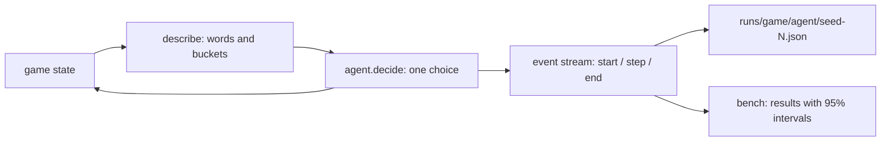

# Arena

A benchmark where decision models (TypeSafe's **Jev** and the open-source **Laya**) play games with zero training. There are three games, each testing a different skill:

| Game | Source | Tests | Options | Main metric |
|---|---|---|---|---|
| Highway | [highway-env](https://github.com/Farama-Foundation/HighwayEnv) `highway-v0` | Safety in traffic | 5 (change lane, keep, faster, slower) | Crash rate |
| Snake | Our own, seeded 10×10 grid | Spatial planning | 3 (turn left, straight, turn right) | Food eaten |
| Blackjack | Gymnasium `Blackjack-v1` (Sutton & Barto rules) | Risk | 2 (stick, hit) | How often the move matches basic strategy |

Every model gets the same text and the same options, and picks one move per decision. Baselines show what no intelligence scores: keep lane and random for Highway, greedy and random for Snake, and basic strategy, always stick and random for Blackjack.

## How it works



- **`arena/games/`** has one module per game. Each game defines its `questions`, `options`, a `fallback` move, its `baselines`, and `reset(seed)`, `describe()`, `step(action)`, `frame()` and `summary()`. Games describe the world in words ("car close ahead (12 m), 4 m/s slower than you", "BLOCKED: wall right next to you", "16 (hard: no ace counted as 11)") because decision models read meaning and can't do arithmetic.
- **`arena/agents/`** has one module per model, all with the same interface, `decide(state, questions) -> answers`:
  - `jev.py`: calls TypeSafe directly or through Vercel AI Gateway, retries 429 and 529 with backoff, and reports only the successful attempt's latency.
  - `laya.py`: downloads the weights on first use and runs the chosen checkpoint locally.
  - `baselines.py`: generic constant and random agents. Game-specific baselines live with their game.
  - `make_agent(name, game)` in `__init__.py` is the only place an agent is chosen by name.
- **`arena/runner.py`** runs any game and yields events: `start`, one `step` per decision, then `end`. A failed decision, or an answer outside the options, falls back to the game's default move and is recorded with an `error`.
- **`arena/bench.py`** runs agents over shared seeds and writes `results/<game>/<timestamp>.json`.
- **`arena/server.py`** serves live episodes (server-sent events), recordings and results to the UI in `ui/`.

## Run it with Docker (one command)

From the repo root:

```
docker compose up --build
```

Open http://localhost:3000. It has three pages: **Arena** (watch two agents play live or from recordings), **Results** (benchmarks), and **Learn** (how Jev and Laya work). `compose.yaml` starts two containers:

- `arena-api` (port 8000) is this Python package. It runs PyTorch on CPU, since GPU containers need a newer NVIDIA driver, and the image is about 2 GB. Laya's weights download into the `laya-models` volume on first start. `runs/` and `results/` are shared with your machine.
- `arena-ui` (port 3000) is `ui/`, built to static files and served by nginx. The image is about 94 MB.

API keys come from the repo-root `.env`. Stop everything with `docker compose down`. The API uses about 1.7 GB of memory once Laya is loaded.

## Setup (without Docker)

```
uv sync
```

`uv sync` installs the `laya` package, which is code only. Laya's weights (2.3 GB) download into `models/laya` the first time Laya runs. They go into a plain folder, not the Hugging Face cache, because the cache uses symlinks that fail on Windows without Developer Mode. Set `LAYA_PATH` to keep them elsewhere.

Jev looks for keys in the environment, then in the repo-root `.env`:

- `TYPESAFE_API_KEY` is preferred. It calls `api.typesafe.ai/v1/systemone` directly with the pinned model `jev-1.13.0`, so runs are reproducible. TypeSafe signups are currently paused.
- `AI_GATEWAY_API_KEY` is the fallback, through Vercel AI Gateway (`typesafe-ai/jev`). The Gateway rate-limits often (HTTP 429), and the agent retries those with backoff.

Locally, PyTorch comes from the CUDA 12.6 index (`pyproject.toml`). If your NVIDIA driver is too old, Laya falls back to CPU, at roughly 200 to 2,000 ms per decision instead of about 33 ms on a GPU.

To run the UI without Docker, use two terminals:

```
uv run python -m arena.server              # API on http://localhost:8000
cd ui && npm install && npm run dev        # UI on http://localhost:3000
```

## Benchmark

```
uv run python -m arena.bench --game highway --episodes 20                  # every agent for the game
uv run python -m arena.bench --game snake --agents jev laya greedy --episodes 50
```

Every agent plays the same seeds, so each faces the same traffic, food and cards. Each episode is saved as a recording in `runs/` (replayable in the UI), and the run is summarized in `results/<game>/<timestamp>.json`:

- **Rates** (crashed, died) come with a 95% **Wilson** interval, which behaves well with few episodes and at 0% or 100%.
- **Averages** (distance, food, match rate) come with a 95% **t-interval**.
- **Decisions:** count, failed, rate-limit retries, latency (median and 95th percentile), and average confidence in the chosen move.
- **Provenance:** seeds, start and finish times, git commit, the Jev route (TypeSafe or Gateway) and the Laya checkpoint and device.
- **Against a reference, where the game has one:** how often each decision matched the best move (basic strategy for Blackjack, the greedy move for Snake), and whether the stated confidence matched being right.

Sensitivity is measured separately, because it needs its own situations rather than played episodes:

```
uv run python -m arena.probe --agents jev laya
```

Each game defines pairs of opposite situations where the right answer clearly differs (8 versus 20 against the same dealer card; a car right in front versus an empty road). Sensitivity is how far the model's answer moves between them, from 0 (same answer to both) to 1 (completely different). A model that scores near 0 is not reading the situation. Results go to `results/probes/<timestamp>.json` and feed the Scorecard page.

Terminology: an **episode** is one full game (a highway drive of up to 40 seconds, a snake game, or 20 blackjack hands) and a **step** is one decision. There are no **epochs**, because nothing is trained: both models are tested exactly as they ship. Sample size is episodes per agent. A handful gives very wide intervals, so treat anything under about 50 as a first look.

## Publish the site

Live at **https://decision-arena-nine.vercel.app** (recordings, results and Learn; live play stays local).

```
uv run python -m arena.export    # refresh ui/public/data from runs/ and results/
cd ui && npm run deploy          # build the static site and deploy it
```

`npm run deploy` builds `out/` and copies the Vercel project link into it, because `next build` recreates that folder. The link lives in `ui/.vercel` and points at the project `decision-arena`. Vercel Authentication is off for this project, so the site is publicly readable. Keys, models and the arena server are never deployed.

## Record single episodes

```
uv run python -m arena.record --game highway --agent jev --episodes 3
uv run python -m arena.record --game blackjack --agent laya --laya-checkpoint multilingual --episodes 1
uv run pytest
```

## Results

The latest benchmark for each game is on the Results page. The first local run's summary is below.

**First benchmark, September 22, 2026:** 10 episodes per agent, seeds 0 to 9. Jev ran through Vercel AI Gateway and Laya's multilingual checkpoint ran on CPU. Ranges are 95% intervals.

| Game | Jev | Laya | Best baseline | Worst baseline |
|---|---|---|---|---|
| Highway, crash rate | **0%** (0 to 28%), 851 m | 90% (60 to 98%), 437 m | Keep lane: 90%, 582 m | Random: 100% |
| Snake, food eaten / death rate | 1.8 / **0%** | 0.5 / 90% | Greedy: **17.3** / 40% | Random: 0.2 / 100% |
| Blackjack, matches basic strategy | **77%** (73 to 81%) | 50% (42 to 57%) | Basic strategy: 100% | Random: 49% |

What the recordings show:

- **Laya does not adapt its moves to the situation.** In Blackjack it chose stick on all 200 decisions, so it scored exactly like the always-stick baseline. In Highway it crashed as often as doing nothing, and 64% of its decisions (116 of 181) were lane changes into a lane that doesn't exist.
- **Jev is safe but passive.** It never crashed on the highway: it kept its lane on 94% of decisions (375 of 400) and drove near the minimum speed. In Snake it never died, but it ate little: 71% of its moves were right turns, so it often circled until the 60-moves-without-food limit ended the game.
- **Neither model plans.** The greedy Snake baseline, a few lines of code, ate about 10 times more food than Jev.
- **Speed:** Jev's typical decision took about 305 ms through the Gateway, with 1,231 rate-limit retries across the run. Laya took 107 to 185 ms on CPU.

Ten episodes is a first look, not a verdict: several intervals are wide. The next step is 50 or more episodes per agent in Colab, with Laya on a GPU.
