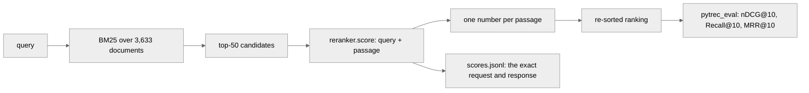

# Rerank

A RAG re-ranker driven by a decision model, evaluated on a public retrieval benchmark.

BM25 retrieves 50 candidate passages per query. Each candidate is then handed to a model as **one typed question** — query and passage in, one number out — and the candidates are re-sorted by that number. The question is whether the ranking gets better, and how much the re-ranking costs in wall clock.

**Nothing is trained here.** This is step 1, and it is deliberately zero-shot: the number below is the baseline that makes a later fine-tune interpretable. Laya's own model card is blunt that its base checkpoints are near chance on typed decisions zero-shot, so a low number here is expected information, not a bug.

## How it works



Every method re-ranks the **same** candidate list, so the comparison is fair and BM25 itself is the floor.

- **`rerank/data.py`** loads BEIR NFCorpus — 3,633 documents, 323 test queries — from the Hugging Face mirror of BEIR's own files (`BeIR/nfcorpus` for the corpus and queries, `BeIR/nfcorpus-qrels` for the official `test.tsv`), so the numbers are comparable to published work. Not the `beir` package: it pulls sentence-transformers, elasticsearch and a torch stack in just to unzip a dataset, and it fetches a zip from a university host that is regularly down. `ir_datasets` would have worked too; `hf_hub_download` gets the identical official files with one small dependency, a cache and a resumable download.
- **`rerank/bm25.py`** builds the candidates. The order it returns is both the BM25 ranking and the tie-break every other method falls back to.
- **`rerank/rerankers/`** has one module per model, all with the same interface, `score(query, passage) -> {score, request, response, latency_ms}`. `make_reranker(name)` in `__init__.py` is the only place a reranker is chosen by name, so adding Jev is a new module and one line — the task does not change.
- **`rerank/rank.py`** turns scores into a ranking. Ties keep the candidate order, so "no opinion" means "no change" rather than "shuffle".
- **`rerank/metrics.py`** wraps `pytrec_eval` (the trec_eval C code). trec_eval has no MRR@10, so the run is cut to the top 10 before `recip_rank` is asked for. `mean_ci` is copied from `arena/arena/bench.py` rather than imported — each demo in this repo stands alone.
- **`rerank/store.py`** is the append-and-flush JSONL log, which doubles as the resume point.
- **`rerank/evaluate.py`** is the task and the CLI.

## Every decision is on the wire

A re-ranker that emits only a score is not good enough here. Every (query, passage) pair scored appends one line to `runs/<tag>/scores.jsonl` holding the exact request sent and the exact response received:

```json
{
  "method": "laya-noul",
  "query_id": "PLAIN-102",
  "doc_id": "MED-3253",
  "score": 0.1733,
  "latency_ms": 621.51,
  "request": {
    "state": {
      "query": "Stopping Heart Disease in Childhood",
      "passage": "Pathobiological determinants of atherosclerosis in youth risk scores..."
    },
    "questions": {
      "relevance": {
        "type": "noul",
        "instructions": "A search engine returned this passage for this query. Does this passage answer the query?"
      }
    }
  },
  "response": {
    "model": "laya-rl-agent",
    "answers": {
      "relevance": {"type": "noul", "noul": 0.1733, "confidence": 0.8267, "action": {"act_probability": 1.0}}
    },
    "usage": {"input_tokens": 233, "output_tokens": 0}
  }
}
```

That file is also why the run is resumable. Rerun the same command after an interruption and only the unscored pairs are sent; the candidate set is pinned in `runs/<tag>/candidates.json` so a resumed run re-ranks exactly the same passages.

## The two question formulations

Nobody has published which typed question ranks better, and the second pass costs one more sweep, so both are run on identical data.

| Name | Type | What it takes | What it returns |
|---|---|---|---|
| `laya-score` | `score` | an ordered list of five rungs, "irrelevant" to "directly answers the query" | the expected position on that scale, 0 to 4 |
| `laya-noul` | `noul` | no criteria at all | one probability that the passage answers the query |

Both are in `rerank/rerankers/laya.py` and both go to the same English checkpoint, the weights already in `arena/models/laya`.

## Pilot results

30 queries, top 50 candidates each, NFCorpus **test** split with the official qrels. 1,500 scoring calls per re-ranker. **Laya and the cross-encoder both ran on CPU** — there is no usable GPU on this machine — so every latency below is a CPU latency and is not comparable to Laya's published 39.5 ms on a T4.

| Ranking | nDCG@10 | Recall@10 | MRR@10 | nDCG@10 vs BM25, paired | p50 | p95 | wall clock |
|---|---|---|---|---|---|---|---|
| BM25 (the floor) | 0.2751 | 0.1280 | 0.5042 | — | — | — | 0.3 s index + 0.1 s search |
| cross-encoder MiniLM-L-6 | **0.2930** | **0.1310** | **0.5500** | **+0.0180** [−0.0141, +0.0500] | 27 ms | 34 ms | 41 s |
| Laya `score` | 0.2111 | 0.1036 | 0.3507 | **−0.0640** [−0.1155, −0.0125] | 846 ms | 1,034 ms | 21 min 30 s |
| Laya `noul` | 0.2046 | 0.1094 | 0.3801 | **−0.0705** [−0.1226, −0.0183] | 743 ms | 1,089 ms | 19 min 35 s |

**Zero-shot Laya is below the BM25 floor, and the gap is real.** Every method re-ranks the same candidates for the same queries, so the comparison is paired per query, and both Laya intervals sit entirely below zero: `score` loses 0.064 nDCG@10 and `noul` loses 0.071. On 30 queries `score` hurt 13 and helped 5; `noul` hurt 12 and helped 5. Re-ranking with this checkpoint, on this dataset, with these questions, makes retrieval worse than doing nothing. That is the result, and it is the baseline a fine-tune has to beat.

The cross-encoder's +0.018 is the expected direction but its interval still crosses zero at 30 queries, so the pilot establishes that it does not hurt, not that it helps.

**Neither question formulation ranked better.** `score` minus `noul`, paired: **+0.0065** nDCG@10, 95% CI [−0.0384, +0.0514]. `score` won 6 queries, `noul` won 9, 15 tied. `score` takes the nDCG@10 headline by 0.0065 and `noul` takes Recall@10 and MRR@10; none of that survives the interval. Two things are worth noting about the raw numbers, though: `noul` came back under 0.5 on 1,398 of 1,500 passages (median 0.087), so it is answering "no, this does not answer the query" almost everywhere and ranking on the residue; and its 4-decimal rounding left only 1,041 distinct values across 1,500 pairs, against 1,413 for `score`. Neither collapsed to a constant — the failure mode that cost this project a week on Blackjack — and both were checked on 3 queries before the pilot ran.

**The speed argument does not survive contact with a CPU.** Laya is 27 to 31 times *slower* per call than the MiniLM cross-encoder here (846 ms against 27 ms), and 1,500 passages take 20 minutes instead of 41 seconds. Laya's published 39.5 ms is a T4 number; this machine has no usable GPU, and the cross-encoder is a 6-layer 22M-parameter model against Laya's 421M, so it is a fair fight only on hardware both can use. What this pilot establishes is that on CPU there is no economic argument for the decision model here at all.

Raw numbers: `results/test-top50-q30-*.json`. Every one of the 4,500 scoring calls behind them is in `runs/test-top50-q30/scores.jsonl`, request and response included.

## Run it

```
uv sync
uv run python -m rerank.evaluate --limit 30 --top-k 50
```

`--limit 0` runs all 323 test queries. `--top-k` sets candidates per query. `--methods` picks a subset (`bm25`, `laya-score`, `laya-noul`, `cross-encoder`). Laya's weights are read from `../arena/models/laya`; `--laya-path` points elsewhere. The dataset lands in the Hugging Face cache, or in `--cache-dir`.

Results go to `results/<tag>-<timestamp>.json`; the raw wire log and the candidate set go to `runs/<tag>/` and are not committed.

```
uv run pytest
```

## What this does not answer yet

- **Whether fine-tuning closes a gap this large.** Zero-shot Laya is 0.064 nDCG@10 *below* a bag-of-words baseline, so a fine-tune has to recover that before it wins anything. That is step 2, and this is the number it has to beat.
- **Whether the pilot's 30 queries generalise to all 323.** The full test split has not been run. The paired intervals are tight enough to call Laya's loss real at n=30; they are not tight enough to call the cross-encoder's +0.018 gain real.
- **Why Laya loses.** The scores vary and look sensible one at a time, but nothing here separates "the checkpoint cannot judge relevance" from "the question is wrong" from "1,000 characters of a medical abstract is not enough to judge on".
- **How Jev compares.** The reranker interface is built for it; only the module is missing.
- **Whether a better question helps.** Two formulations were tried, not twenty, and no prompt was tuned against the test split — doing so would make the number meaningless.
- **Whether the 1,000-character passage cut matters.** NFCorpus abstracts are longer than the English checkpoint's ~320-token state budget, so they are cut where it is visible in the recorded request. Nothing here measures what the tail would have added.
- **What this costs on a GPU.** Every timing here is CPU-only.
